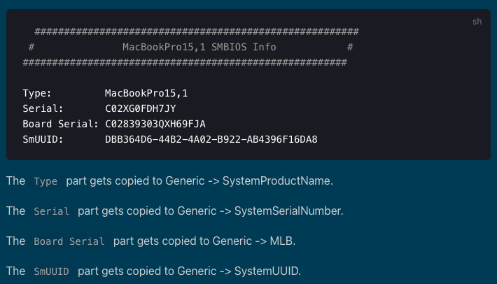

# How to install macOS Big Sur 11.2 on a Lenovo IdeaPad 330-15ICH
<ins>Disclaimer 1:</ins> Hackintoshing is against Apple EULA for macOS. This repository is only here for educational purposes. Try this at your own risk only if you want to and you know what you are doing.  
<ins>Disclaimer 2:</ins> Hackintoshing is not an exact science. Consequently, there are chances that this tutorial does not work, even on the exact same laptop. YOU are reponsible of your hardware and what you do with it. I am not responsible if you brick your machine or anything.

## Steps
### Step 1
Download an image of macOS Big Sur. [This image](https://www.mediafire.com/file/ws7fpljza84ueia/Olarila+BigSur+11.2.raw/file) worked perfectly fine for me.

### Step 2
Flash this image to your USB drive (16 GB +) using [Etcher](https://www.balena.io/etcher/).

### Step 3
Download and unzip [GenSMBIOS](https://github.com/corpnewt/GenSMBIOS/archive/refs/heads/master.zip), [gibMacOS](https://github.com/corpnewt/gibMacOS/archive/refs/heads/master.zip) and [ProperTree](https://github.com/corpnewt/ProperTree/archive/refs/heads/master.zip). You will additionnaly need to install [Python (3.8 +)](https://www.python.org/downloads/) on your computer (add Python to PATH when it is prompted during installation).

### Step 4
Download and unzip [this repository](https://github.com/Firmin-Launay/Hackintosh_Lenovo_IdeaPad_330-15ICH/archive/refs/heads/main.zip).

### Step 5
Run ProperTree and open `EFI/OC/config.plist` from this repository with it.

### Step 6
Run GenSMBIOS. Select “Generate SMBIOS” and type “MacBookPro14,1”. Enter the given values in the `PlatformInfo` part of the `config.plist` file opened in ProperTree, like in the following image:

<em>Source: [dortania.github.io](https://dortania.github.io/OpenCore-Install-Guide/config-laptop.plist/coffee-lake.html#platforminfo)</em>

### Step 7
Open `MakeInstall` from gibMacOS (as an administrator) and find the number of your USB drive. Assuming that `1` is the number of your USB drive, type “1U”.

### Step 8
Mount the EFI partition of your USB drive (on Windows, assign this partition a letter using the partition manager or a program such as [AOMEI Partition Assistant](https://www.aomeitech.com/aomei-partition-assistant.html) (the standard version is enough)).

### Step 9
Save the `config.plist` file in ProperTree and copy the `EFI` folder (the folder itself, not its content) to the root of the EFI partition you just mounted.

### Step 10
Shutdown your Lenovo PC, open the BIOS, and:
* select `UMA Only` for `Graphic Device`;
* set `Intel Virtual Technology` and `Intel(R) Hyper-Threading Technology` to `Disabled`;
* in `Storage`, set `Controller Mode` to `AHCI mode`;
* set `Intel SGX` and `Secure Boot` to `Disabled`.

### Step 11
Follow the normal process of a macOS installation (you will have to format your disk to the “Mac OS extended (journaled)” format using Disk Utility). The boot option name you will have to select will change (“Install macOS Big Sur” ➔ “Macintosh HD” ➔ the name of the partition you chose to install macOS on)  

    &nbsp; 
    <b>And it is done!</b>

